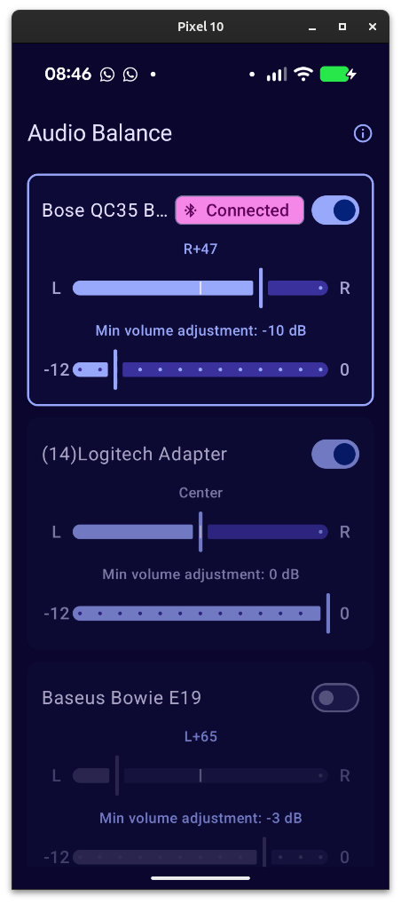
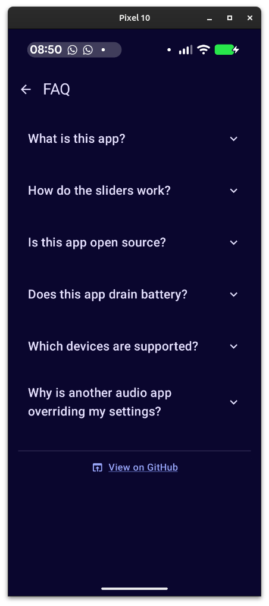

# Android Audio Balance

*Fix left/right audio imbalance on your Bluetooth headphones*

[](LICENSE)
[](https://developer.android.com/about/versions/oreo)
[](https://github.com/Benibur/android-audio-balance/actions/workflows/build.yml)

## What it does

Many Bluetooth headphones produce noticeably different volume levels on the left and right sides — a common frustration for people with hearing asymmetry or headphones that have drifted out of balance over time. Android has no built-in per-device stereo balance control for Bluetooth audio.

Android Audio Balance solves this by letting you set a custom left/right balance and gain offset for each Bluetooth device. When you connect your headphones, the app automatically applies your saved settings using Android's `AudioEffect` DynamicsProcessing API — no manual adjustment needed every time.

| Device list | FAQ |
|---|---|
|  |  |

## Requirements

- Android 8 (API 26) or higher
- Bluetooth A2DP headphones (wired headphones and internal speaker are not supported)
- USB debugging enabled on your device for sideload installation

## Build & sideload

You will need JDK 17 (Temurin recommended) and Android SDK with API 35 installed.

```bash
git clone https://github.com/Benibur/android-audio-balance.git
cd android-audio-balance
./gradlew assembleDebug
adb install app/build/outputs/apk/debug/app-debug.apk
```

The APK is a debug build — it is signed with the default debug keystore. You can also download a pre-built APK from the [Releases](https://github.com/Benibur/android-audio-balance/releases) page.

## Known limitations

- **AudioEffect session 0 conflicts:** Apps that also claim session 0 effects (e.g. Wavelet, some equalizers) may override or conflict with this app's DynamicsProcessing chain. If your balance settings are not being applied, try disabling other audio effect apps and reconnecting your headphones.
- **Bluetooth A2DP only:** Wired headphones and the internal speaker are not supported by design — the app listens for Bluetooth A2DP connect/disconnect events.
- **Not on the Play Store:** Installation is via ADB sideloading only. See [Build & sideload](#build--sideload) above.

## Contributing

See [CONTRIBUTING.md](CONTRIBUTING.md).

## License

MIT — see [LICENSE](LICENSE).
